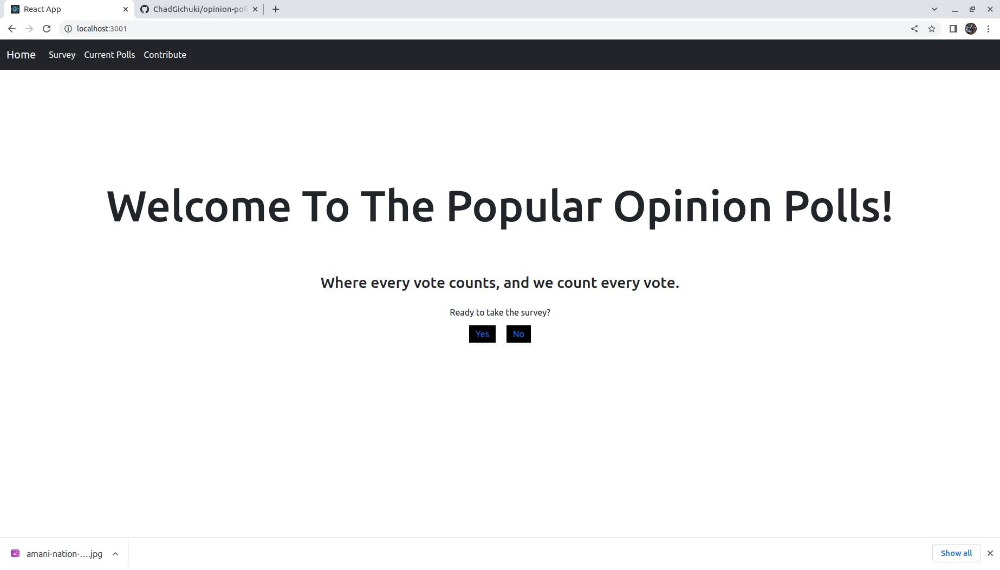

# Opinion-Polls
A polling web app for popular opinions.

This is a Single Page Application (SPA) where users vote between 2 closely related or widely contested options in various fields such as sports, technology, vehicles, smart phones etc.

However, the backend is not yet deployed and can only be hosted locally. The repository can be cloned from [here](https://github.com/ChadGichuki/opinion-polls-json-server.git)

When the app is running you should expect to see a home page like this:




## Getting Started
### Pre-requisites
The following should be installed to run the program locally: nodejs, npm

### Installation
- Fork and clone the repository.
```
git clone https://github.com/ChadGichuki/opinion-polls-frontend.git
```

- Cd into the project folder.
```
cd path/to/folder/Friends-of-Frodo-Baggins
```

- Open in a code editor.
```
code .
```

- Code away!

### Running the program.
NOTE: Opening the files directly on the browser will not work since the api key is in a file added to .gitignore. You will not be able to fetch data from the API.
To run the app locally, you may:
- Install a http server
```
npm install --global http-server
```
- While in the project folder /Friends-of-Frodo-Baggins run the command:
```
http-server
```
- Visit the address given on the terminal to view the webpage.

## Deployment
The app is not yet hosted anywhere.

## Licence
A copy of the General Public License v3.0 can be found [here.](LICENSE)

## Authors
Richard Gichuki. [Find me here.](https://github.com/ChadGichuki)

## Acknowledgements
Grace Umutesi - Technical Mentor, Moringa School, Fullstack Software Engineering Course, May to October 2022.

